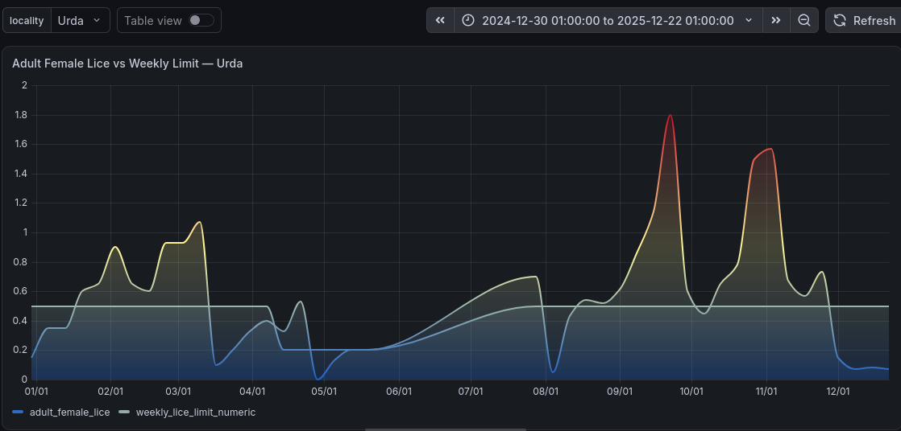

# Fish Health Analytics & Monitoring Dashboard

A portfolio project analyzing weekly salmon-louse monitoring data from Norwegian aquaculture sites using **Python, PostgreSQL, SQL, and Grafana**.

The project develops a reproducible workflow from raw fish-health data through cleaning, feature engineering, compliance analysis, early-warning indicators, locality benchmarking, database integration, and interactive dashboard visualization.

## Project Objectives

The main objectives were to:

- analyze weekly adult female salmon-louse levels
- evaluate compliance with weekly regulatory limits
- identify localities with repeated breaches
- investigate relationships between sea temperature and lice pressure
- engineer lag, trend, and warning features
- develop an exploratory risk-ranking framework
- benchmark localities using normalized performance indicators
- store processed analytical data in PostgreSQL
- build an interactive Grafana monitoring dashboard

## Data

The primary dataset contains weekly Norwegian aquaculture locality observations from BarentsWatch.

After processing:

- **55,718 weekly observations**
- **30,297 valid compliance observations**
- **1,066 weekly breaches**
- **3.52% overall breach rate among valid observations**

The analysis includes locality information, adult female lice counts, mobile and sessile lice, sea temperature, production area, regulatory limits, and derived analytical features.

## Analytical Workflow

```text
BarentsWatch data
        ↓
Python / Pandas
        ↓
Data cleaning and validation
        ↓
Compliance analysis
        ↓
Feature engineering
        ↓
Temperature analysis
        ↓
Warning and anomaly analysis
        ↓
Locality benchmarking
        ↓
PostgreSQL
        ↓
SQL validation and analysis
        ↓
Grafana dashboard
```

## Feature Engineering

The project developed features including:

- 1-week and 2-week lice lags
- weekly lice change
- 2-week lice change
- 3-week rolling mean
- distance to regulatory limit
- ratio to regulatory limit
- previous breach
- future breach
- cleaned sea temperature
- temperature lag
- temperature change
- 3-week temperature mean
- lice-change anomaly indicators
- warning levels

## Key Findings

The processed dataset contained **1,066 regulatory breaches among 30,297 valid observations**, corresponding to an overall breach rate of approximately **3.52%**.

Sea temperature showed a modest positive association with adult female lice levels.

Weeks preceding a future breach occurred under warmer sustained temperature conditions on average than non-breach weeks, although this relationship should be interpreted as an association rather than causation.

A simple early-warning rule based on increasing lice levels and proximity to the weekly limit identified a subset of observations with substantially higher subsequent breach rates.

An exploratory risk score combining lice pressure, recent lice growth, and temperature produced a clear gradient across risk quartiles. This score is intended as a decision-support indicator and is not presented as a validated predictive model.

## PostgreSQL

Processed data were loaded into PostgreSQL in two main tables:

### `weekly_features`

Weekly analytical observations used for:

- time-series monitoring
- compliance analysis
- warning indicators
- temperature analysis
- Grafana visualization

### `locality_benchmark`

Locality-level summary metrics used for:

- benchmarking
- breach-rate comparison
- mean lice pressure
- risk-score comparison
- high-risk-week counts

SQL scripts are stored in:

```text
sql/
├── 01_create_tables.sql
├── 02_validation_queries.sql
├── 03_analysis_queries.sql
└── 04_grafana_views.sql
```

## Grafana Dashboard

The interactive Grafana dashboard includes:

- Total Weekly Observations
- Total Weekly Breaches
- Valid Lice Observations
- Adult Female Lice vs Weekly Regulatory Limit
- Sea Temperature
- Warning History
- Top 10 Localities by Breach Count
- Locality Benchmarking
- interactive locality selection

### Full Dashboard


### Lice Pressure vs Weekly Limit



### Locality Benchmarking


## Repository Structure

```text
fish-health-analytics/
├── data/
│   ├── raw/
│   └── processed/
├── notebooks/
├── outputs/
├── sql/
├── dashboard/
│   ├── fish_health_monitoring_dashboard.json
│   └── screenshots/
├── docs/
│   ├── methodology.md
│   └── findings.md
├── README.md
└── .gitignore
```

## Tools

- Python
- Pandas
- Jupyter Notebook
- PostgreSQL
- SQL
- DBeaver
- Grafana
- Git
- GitHub

## Project Status

**Completed**

The project demonstrates an end-to-end analytical workflow for aquaculture fish-health monitoring, from raw data preparation to database-backed interactive decision-support visualization.
